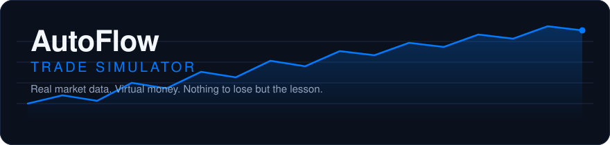

<p align="center">
  
</p>

<h3 align="center">Team CDT &nbsp;·&nbsp; AutoFlow Trade Simulator</h3>

<p align="center">
  A risk-free trading simulator that runs on real market data, so beginners can learn<br>
  how markets behave without losing money finding out.
</p>

<p align="center">
  <a href="https://github.com/COS301-SE-2026/AutoFlow-Trade-Simulator/actions/workflows/main.yml"></a>
  <a href="https://codecov.io/gh/COS301-SE-2026/AutoFlow-Trade-Simulator"></a>
  <a href="https://github.com/COS301-SE-2026/AutoFlow-Trade-Simulator/wiki/Functional-Requirements"></a>
  <a href="https://github.com/COS301-SE-2026/AutoFlow-Trade-Simulator/issues"></a>
  <a href="https://stats.uptimerobot.com/"></a>
  <a href="https://github.com/COS301-SE-2026/AutoFlow-Trade-Simulator/pulls"></a>
</p>

<p align="center">
  <strong><a href="https://TODO-LIVE-URL">Live System</a></strong> &nbsp;·&nbsp;
  <a href="https://github.com/COS301-SE-2026/AutoFlow-Trade-Simulator/wiki">Documentation Wiki</a> &nbsp;·&nbsp;
  <a href="https://github.com/orgs/COS301-SE-2026/projects">Project Board</a>
</p>

<p align="center"></p>

##  Why AutoFlow

Most trading platforms are built for people who already know how to trade. Beginners open them to dense dashboards, metrics nobody explains, and no sense of what a good decision looks like. Practice accounts help, but they hand you a balance and leave you to work out the rest alone. A practice account tells you that you lost money, not why. Most people give up before they learn anything, and some carry the same habits into a real account.

AutoFlow is a trading simulator that runs on real market data. You trade with virtual money, so a bad call costs nothing but still teaches the lesson. Leaderboards and achievements give you a reason to come back, and an optional AI assistant explains what your portfolio is actually exposed to.

<table width="100%">
  <tr>
    <td width="33%" valign="top">
      <h3 align="center"> Realistic Simulation</h3>
      <p align="center">Stocks, options, crypto and commodities priced off live market data. Virtual balance, real volatility.</p>
    </td>
    <td width="33%" valign="top">
      <h3 align="center"> Gamified Learning</h3>
      <p align="center">Leaderboards and achievements that turn practice into something worth competing at.</p>
    </td>
    <td width="33%" valign="top">
      <h3 align="center"> AI-Powered Insights</h3>
      <p align="center">An optional assistant reviews your portfolio and suggests where to look next.</p>
    </td>
  </tr>
</table>

<p align="center"></p>

##  Documentation

All project documentation lives in the [GitHub Wiki](https://github.com/COS301-SE-2026/AutoFlow-Trade-Simulator/wiki).

| | Document | Description |
| :--- | :--- | :--- |
| **SRS** | [Functional Requirements](https://github.com/COS301-SE-2026/AutoFlow-Trade-Simulator/wiki/Functional-Requirements) | R1–R10, mapped to subsystems. |
| **SRS** | [Non-Functional Requirements](https://github.com/COS301-SE-2026/AutoFlow-Trade-Simulator/wiki/Non%E2%80%90functional-Requirements) | Scalability, performance, maintainability, security and usability, quantified. |
| **SAS** | [Software Architecture Specification](https://github.com/COS301-SE-2026/AutoFlow-Trade-Simulator/wiki/Software-Architecture-Specifications) | Architectural requirements, technology requirements, API contracts and deployment. |
| | [Coding Standards](https://github.com/COS301-SE-2026/AutoFlow-Trade-Simulator/wiki/AutoFlow-Coding-Standards) | Conventions, file structure and tooling configuration. |
| | [Testing Policy](https://github.com/COS301-SE-2026/AutoFlow-Trade-Simulator/wiki/Testing-Policy-Document) | Testing objectives, types, tools and defect management. |
| | [User Manual](https://github.com/COS301-SE-2026/AutoFlow-Trade-Simulator/wiki/User-Manual) | Walkthrough of the system for non-technical users. |
| | [Brand Style Guide](https://github.com/COS301-SE-2026/AutoFlow-Trade-Simulator/wiki/Brand-Style-Guide) | Colour, typography, tokens, components and accessibility. |
| | [Wireframes](https://github.com/COS301-SE-2026/AutoFlow-Trade-Simulator/wiki/Wireframes) | Interface designs. |

<p align="center"></p>

##  Tech Stack

| Component | Stack | Why |
| :--- | :--- | :--- |
| **Frontend** | `Next.js` `React` `TailwindCSS` | Server components for the dashboard, Tailwind for a consistent design system. |
| **Backend** | `FastAPI` `Python` | Async performance, plus direct access to the Python ML ecosystem. |
| **Database** | `PostgreSQL` `Redis` | Postgres for transactional data, Redis for caching and queuing. |
| **Machine Learning** | `scikit-learn` | The models behind trading signals. |
| **Market Data** | `stock-poller` | A standalone async service that ingests live prices into Postgres. |
| **Infrastructure** | `Vercel` `AWS EC2` `ECS` `ECR` `S3` | Frontend on Vercel; backend on EC2, the data poller on ECS, images in ECR. |
| **CI/CD** | `GitHub Actions` `AWS CodeDeploy` | Lint and test on every PR, blue/green deployment on merge to `main`. |
| **Containerisation** | `Docker` `Docker Compose` | Reproducible builds, and one-command local orchestration. |

<p align="center"></p>

##  Engineering Process

<table width="100%">
  <tr>
    <td width="50%" valign="top">
      <h4>Branching Strategy</h4>
      <ul>
        <li><code>main</code> — production. Protected; always deployable.</li>
        <li><code>dev</code> — integration branch for completed work.</li>
        <li><code>feature/*</code> — one branch per use case, merged into <code>dev</code> by pull request.</li>
        <li><code>database/*</code>, <code>docs/*</code> — schema and documentation work.</li>
      </ul>
    </td>
    <td width="50%" valign="top">
      <h4>Pipeline</h4>
      <ul>
        <li><strong>Pull request → <code>main</code></strong> runs backend lint and tests, stock-poller tests, and frontend lint, tests and build.</li>
        <li><strong>Push to <code>main</code></strong> builds the image, pushes to ECR, then triggers CodeDeploy.</li>
        <li><strong>Rollback</strong> is by image tag: every image is tagged with its commit SHA, so redeploying a previous tag reverts the release.</li>
      </ul>
    </td>
  </tr>
</table>

**Environments** — `development` runs locally via Docker Compose; `production` is deployed automatically from `main`. Migrations run on the instance during the CodeDeploy `AfterInstall` hook, before the new container serves traffic.

**Secrets** — no credentials are committed. Local configuration follows the `.env.example` pattern; CI and deployment read from GitHub Actions secrets.

<p align="center"></p>

##  Getting Started

You'll need **Node.js**, **npm** and **Docker**.

```bash
git clone https://github.com/COS301-SE-2026/AutoFlow-Trade-Simulator.git
cd AutoFlow-Trade-Simulator

cp .env.example .env   # 1. configure
npm run setup          # 2. install frontend + backend dependencies
npm run db:start       # 3. start PostgreSQL and Redis
npm run migrate        # 4. build the schema
npm run db:reset       # 5. seed starting data
npm run dev            # 6. run frontend + backend
```

<details>
<summary><strong>Every command</strong></summary>
<br>

| Command | What it does |
| :--- | :--- |
| `npm run setup` | Installs every dependency in the project. |
| `npm run dev` | Runs the frontend and backend dev servers. |
| `npm run db:start` | Starts the local PostgreSQL and Redis containers. |
| `npm run db:stop` | Stops them again. |
| `npm run db:reset` | Drops the tables, re-runs migrations, reseeds. |
| `npm run migrate` | Applies pending migrations. |
| `npm run migrate:dev` | Creates a new migration. |
| `npm run lint` | Lints the backend and frontend. |
| `npm run test` | Runs the backend, stock-poller and frontend test suites. |
| `npm run perf` | Runs the Lighthouse and k6 performance tests. |

</details>

<p align="center"></p>

##  The Team

<p align="center">Team CDT, five developers building AutoFlow for EPI-USE.</p>

<br>

<table width="100%">
  <tr>
    <td width="50%" align="center" valign="top">
      <br>
      <strong>Michael Neto</strong><br>
      <sub><b>Full-Stack Developer</b></sub><br><br>
      <sub>A full-stack developer studying Information and Knowledge Systems. Strengths in learning quickly and problem-solving. Passionate about the end-user’s experience.</sub>
      <br><br>
      <a href="https://github.com/u24641342">GitHub</a> &nbsp;·&nbsp;
      <a href="https://www.linkedin.com/in/michael-neto-0211563b9/">LinkedIn</a>
      <br><br>
    </td>
    <td width="50%" align="center" valign="top">
      <br>
      <strong>Dillon Kung</strong><br>
      <sub><b>Backend Developer</b></sub><br><br>
      <sub>A final-year computer science student who enjoys problem-solving and acquiring new skills. Interested in back-end business logic and database design.</sub>
      <br><br>
      <a href="https://github.com/u24614582">GitHub</a> &nbsp;·&nbsp;
      <a href="https://www.linkedin.com/in/dillon-kung/">LinkedIn</a>
      <br><br>
    </td>
  </tr>
  <tr>
    <td width="50%" align="center" valign="top">
      <br>
      <strong>Caitanya Singh</strong><br>
      <sub><b>Backend Developer</b></sub><br><br>
      <sub>A backend developer with experience in designing and implementing scalable backend architectures and integrating APIs. Passionate about building robust backend systems.</sub>
      <br><br>
      <a href="https://github.com/u24603199">GitHub</a> &nbsp;·&nbsp;
      <a href="https://www.linkedin.com/in/caitanya-krpa-narain-singh-4316393b6/">LinkedIn</a>
      <br><br>
    </td>
    <td width="50%" align="center" valign="top">
      <br>
      <strong>Grant Nel</strong><br>
      <sub><b>Full-Stack Developer</b></sub><br><br>
      <sub>A 3rd year Computer Science student with an interest in mathematics and financial markets. Proficient in industry-standard desktop and mobile technologies.</sub>
      <br><br>
      <a href="https://github.com/u24574547">GitHub</a> &nbsp;·&nbsp;
      <a href="https://www.linkedin.com/in/grant-nel-72a0573b5">LinkedIn</a>
      <br><br>
    </td>
  </tr>
  <tr>
    <td width="100%" align="center" valign="top" colspan="2">
      <br>
      <strong>Finnley Wyllie</strong><br>
      <sub><b>Backend &amp; Software Engineer</b></sub><br><br>
      <sub>A final-year Computer Science student specialising in backend systems and software engineering. Passionate about dissecting complex problems and crafting efficient, elegant solutions.</sub>
      <br><br>
      <a href="https://github.com/Finn-Wyll">GitHub</a> &nbsp;·&nbsp;
      <a href="https://za.linkedin.com/in/finnley-wyllie-1b24972a7">LinkedIn</a>
      <br><br>
    </td>
  </tr>
</table>

<p align="center"></p>

##  Built With Support From

- **EPI-USE**, our industry client, for the brief behind AutoFlow
- The maintainers of the open-source tools this project is built on

<p align="center"></p>
